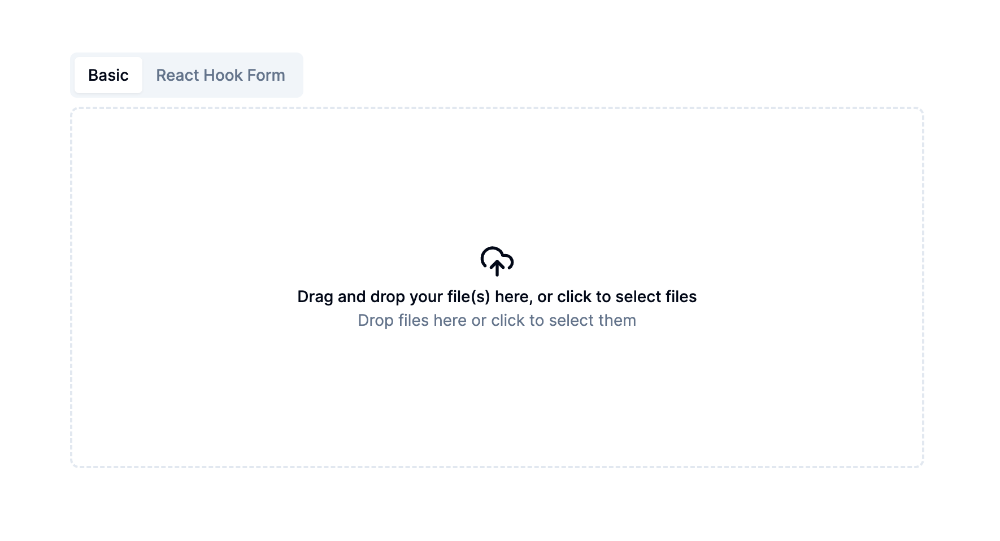

A basic uploader component for shadcn. Not linked to any backend or any third party service. No preview, nothing fancy, just a stupidly simple drag and drop component.

#### TLDR

- The source code for the uploader component: [`/src/components/uploader.tsx`](https://github.com/karimdaghari/shadcn-uploader/tree/main/src/components/uploader.tsx)
- The source code for the uploader with react-hook-form integration: [`/src/components/uploader-input.tsx`](https://github.com/karimdaghari/shadcn-uploader/tree/main/src/components/uploader-input.tsx)

#### Perquisites

- `react-dropzone` for drag and drop functionality.
- `lucide-react` for the cloud icon

```sh
pnpm add react-dropzone lucide-react
```

#### Shadcn prerequisites

- [`sonner`](https://ui.shadcn.com/docs/components/sonner) for the notification system.
- [`typography`](https://ui.shadcn.com/docs/components/typography) for the typography styles (you can also copy them directly from `/src/components/ui/typography.tsx`).

```sh
pnpm dlx shadcn-ui@latest sonner
```

And if you'll be using the `Uploader` component in a form, you'll need to have the [`Form`](https://ui.shadcn.com/docs/components/form) component from `@shadcn/ui` as well.

```sh
pnpm dlx shadcn-ui@latest form
```
